# **Deployment of 3-tier Java Web Application on Amazon EKS using GitHub Actions**

## **Prerequisites** 

- [x]  AWS Account
- [x]  Python3 
- [x]  Terraform & Helm 
- [x]  SonarCloud Account 
- [x]  Code editor of your choice
- [x]  GitBash
- [x]  GoDaddy Domain

# Let’s Start the Project 

## **Part 1: Clone the code locally with GitBash**

```
git clone https://github.com/teodor1006/DevSecOps-JavaWebApp.git
```

## **Part 2: Create an IAM User & Configure AWS CLI**

### **Step 1: Create IAM User**

* Open the AWS Management Console and sign in with your AWS account.

* Navigate to the IAM dashboard.

* In the left sidebar, click on "Users" and then click the "Add user" button.

* Enter a username, check "Programmatic access" for AWS CLI, and click "Next: Permissions."

* Choose "Attach existing policies directly" and select:

```
AdministratorAccess
AmazonEC2ContainerRegistryFullAccess
```

* Review your choices and click "Create user."

* On the user details page, go to the "Security credentials" tab.

* Under the "Access keys" section, click "Create access key."

* Download the CSV file containing the access key ID and secret access key. Keep this file secure as it will not be accessible again.

### **Step 2: Configure AWS CLI**

* Open a terminal or command prompt (In my case gitbash).

* Run the following command:

```
aws configure
```

* Enter the IAM user's access key ID & secret access key from the stored CSV File, default region and output format when prompted.

```
AWS Access Key ID [None]: YOUR_ACCESS_KEY_ID
AWS Secret Access Key [None]: YOUR_SECRET_ACCESS_KEY
Default region name [None]: us-east-1
Default output format [None]: json
```

* AWS CLI is now configured with the IAM user credentials.

## **Part 2: Create a Dockerfile**

* Create a **`Dockerfile`** in the root directory of the project with the following contents:

```
FROM openjdk:11 AS BUILD_IMAGE
RUN apt update && apt install maven -y
COPY ./ vprofile-project
RUN cd vprofile-project && mvn install

FROM tomcat:9-jre11
RUN rm -rf /usr/local/tomcat/webapps/*
COPY --from=BUILD_IMAGE vprofile-project/target/vprofile-v2.war  /usr/local/tomcat/webapps/ROOT.war

EXPOSE 8080
CMD ["catalina.sh", "run"]
```

## **Part 3: Setting Up SonarCloud for Code Quality Analysis**

### **Step 1: Configure SonarCloud**

* First go to [http://sonarcloud.io/](http://sonarcloud.io/) and click on connect with GitHub.
* After signing in to SonarCloud, create a new organization that will hold your projects.
* In SonarCloud, go to your Account Settings -> Security and generate a new token. This token will be used to authenticate SonarCloud with your GitHub repository.
* Go to your GitHub repository. Navigate to "Settings" > "Secrets". Add a new secret with the name **`SONAR_TOKEN`** and paste the token generated in the previous step.
* Add a sonar-project.properties file to the root of your project. Configure this file with the necessary settings, such as the project key, organization key, and source directory. 

### **Step 2: Set Up a Quality Gate**

* Choose the organization that corresponds to the project for which you want to set up the Quality Gate.
* In the left sidebar, click on "Quality Gates."
* Click on the "Create" button to create a new Quality Gate.
* Define the conditions that your code must meet to pass the Quality Gate. This can include metrics such as code coverage, code duplication, and specific rules violations.
* After configuring the conditions, save the Quality Gate.
* Go to Your Project and in the project settings, find the "Quality Gates" section.
* Choose the Quality Gate you created from the list and associate it with your project.
* Save the changes to apply the Quality Gate to your project.

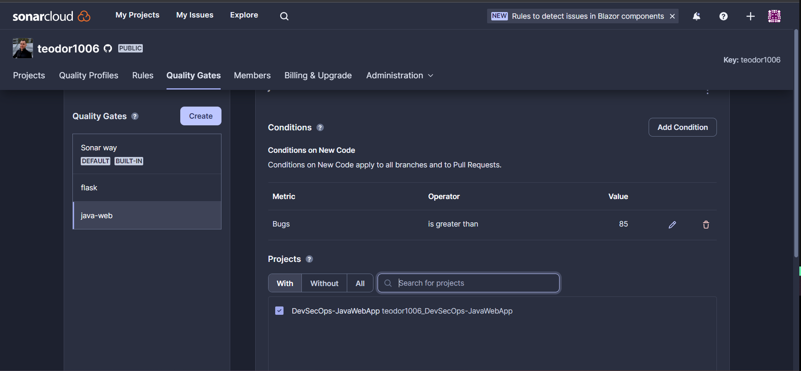

### **Step 3: Create GitHub Token for SonarCloud**

* Go to your GitHub account.
* Click on your profile picture in the top-right corner and select "Settings."
* In the left sidebar, click on "Developer settings."
* In the Developer settings, click on "Personal access tokens" under "Access tokens."
* Click the "Generate token" button.
* Once generated, copy the token immediately. GitHub will only show it once for security reasons.
* After that store the token in your GitHub repository with the name **`GIT_TOKEN`**.

* You should have stored the following secrets:

```
SONAR_ORGANIZATION
SONAR_PROJECT_KEY
SONAR_TOKEN
SONAR_URL
```

## **Part 4: Integrating Slack for Notifications**

### **Step 1: Set Up a Slack Workspace and Obtain a Webhook URL**

* Go to the [https://api.slack.com/apps](https://api.slack.com/apps) page and create a new app for your workspace.
* After creating the app, enable "Incoming Webhooks" in the "Features" section.
* Scroll down to the "Incoming Webhooks" section and click on "Add New Webhook to Workspace." Choose the channel where you want notifications to be sent.
* Once added, copy the generated Webhook URL. This URL will be used to send notifications to your Slack channel.

### **Step 2: Add Slack Webhook URL as a Secret in GitHub**

* Go to "Settings" > "Secrets" in your repository.
* Click on "New repository secret."
* Name the secret **`SLACK_WEBHOOK_URL`** and paste the Webhook URL you obtained from Slack.

## **Part 5: Create S3 bucket for Terraform later and ECR Repo with Boto3**

* S3 Bucket:

```
# pip install awscli boto3
import boto3

s3_bucket_name = 'vprostate' # Make sure to give it a unique name otherwise it won't work
region = 'us-east-1'

def create_s3_bucket():
    s3_client = boto3.client('s3', region_name=region)

    s3_client.create_bucket(Bucket=s3_bucket_name)
    print(f"S3 bucket {s3_bucket_name} created")

if __name__=='__main__':
    create_s3_bucket() 
```

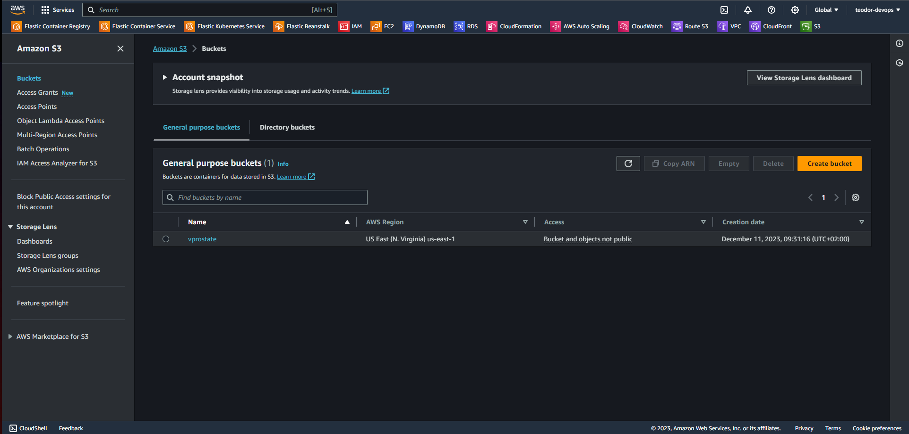

* ECR Repo

```
# pip install awscli boto3
import boto3

region = 'us-east-1'
ecr_repo_name = 'vpro-app-image'

def create_ecr_repository():
    ecr_client = boto3.client('ecr', region_name=region)

    response = ecr_client.create_repository(repositoryName=ecr_repo_name)
    ecr_repo_uri = response['repository']['repositoryUri']
    print(f"ECR repository {ecr_repo_name} created with URI: {ecr_repo_uri}")

if __name__=='__main__':
    create_ecr_repository()
```
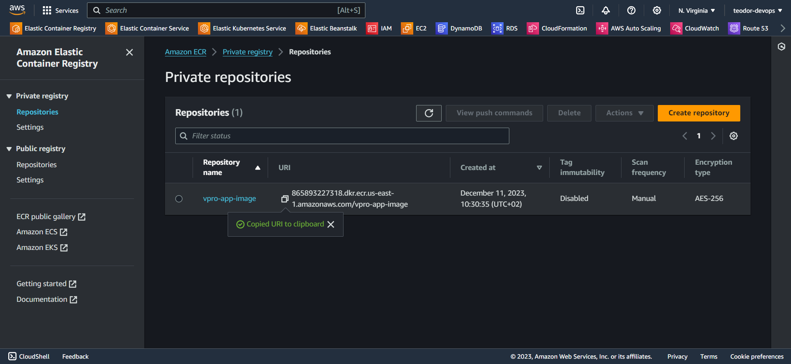


## **Part 6: Build and Push a DockerImage to your Amazon ECR Repo**

### **Step 1: Store your AWS secrets in your GitHub Repo**

* After that go to your github repo where you stored the project -> Settings -> Secrets and variables -> Actions -> New repository secret.

```
AWS_ACCESS_KEY_ID
AWS_SECRET_ACCESS_KEY
REGISTRY
```

* Before starting creating the workflow make sure that you go to your github repo -> Settings -> Actions -> General -> Workflow permissions -> Click on Read and write permissions

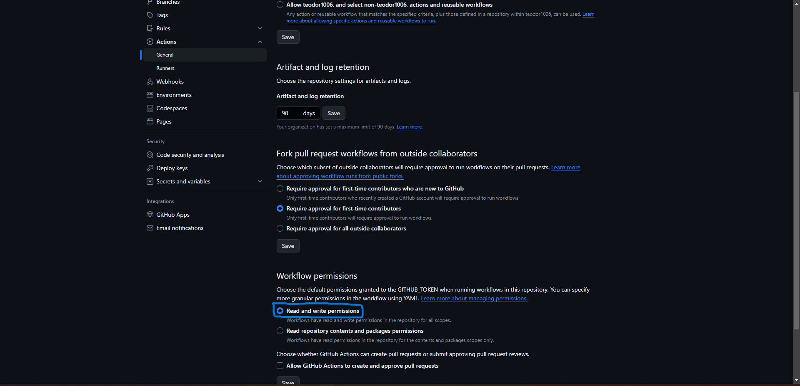

* Also make sure that you have the following secrets stored

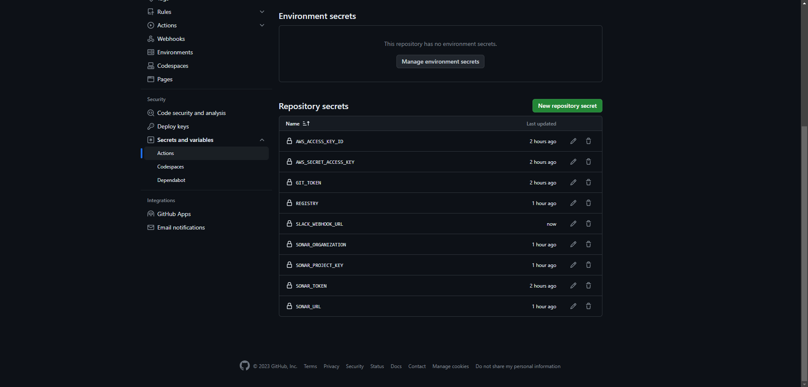

### **Step 2: Write the workflow**

* Create a folder in your project directory: .github/workflows and write the following workflow: 

```
name: Java Web App Actions
on: workflow_dispatch       # [push, workflow_dispatch]
env: 
  AWS_REGION: us-east-1
  ECR_REPOSITORY: vpro-app-image
jobs:
  Testing:
    runs-on: ubuntu-latest
    steps:
      - name: Code checkout
        uses: actions/checkout@v4

      - name: Maven test
        run: mvn test

      - name: Checkstyle
        run: mvn checkstyle:checkstyle

      - name: Setup Java 11
        uses: actions/setup-java@v3
        with:
          distribution: 'temurin'
          java-version: '11'

      - name: Setup SonarQube
        uses: warchant/setup-sonar-scanner@v7
   
      - name: SonarQube Scan
        run: sonar-scanner
           -Dsonar.host.url=${{ secrets.SONAR_URL }}
           -Dsonar.login=${{ secrets.SONAR_TOKEN }}
           -Dsonar.organization=${{ secrets.SONAR_ORGANIZATION }}
           -Dsonar.projectKey=${{ secrets.SONAR_PROJECT_KEY }}
           -Dsonar.sources=src/
           -Dsonar.junit.reportsPath=target/surefire-reports/ 
           -Dsonar.jacoco.reportsPath=target/jacoco.exec 
           -Dsonar.java.checkstyle.reportPaths=target/checkstyle-result.xml
           -Dsonar.java.binaries=target/test-classes/com/visualpathit/account/controllerTest/

      - name: SonarQube Quality Gate check
        id: sonarqube-quality-gate-check
        uses: sonarsource/sonarqube-quality-gate-action@master
        timeout-minutes: 5
        env:
          SONAR_TOKEN: ${{ secrets.SONAR_TOKEN }}
          SONAR_HOST_URL: ${{ secrets.SONAR_URL }} 


  BUILD_AND_PUBLISH:
    needs: Testing
    runs-on: ubuntu-latest
    steps:
      - name: Code checkout
        uses: actions/checkout@v4

      - name: Build & Upload Image to ECR
        uses: appleboy/docker-ecr-action@master
        with:
         access_key: ${{ secrets.AWS_ACCESS_KEY_ID }}
         secret_key: ${{ secrets.AWS_SECRET_ACCESS_KEY }}
         registry: ${{ secrets.REGISTRY }}
         repo: ${{ env.ECR_REPOSITORY }}
         region: ${{ env.AWS_REGION }}
         tags: latest,${{ github.run_number }}
         daemon_off: false
         dockerfile: ./Dockerfile
         context: ./
        
  TRIVY_SCAN:
    needs: BUILD_AND_PUBLISH
    runs-on: ubuntu-latest
    steps:
      - name: Code checkout
        uses: actions/checkout@v4

      - name: Run Trivy vulnerability scanner
        uses: aquasecurity/trivy-action@master
        with: 
          image-ref: '${{ secrets.REGISTRY }}/${{ env.ECR_REPOSITORY }}:${{ github.run_number }}'
          format: 'sarif'
          output: 'trivy-results.sarif' 
        env:
          AWS_ACCESS_KEY_ID: ${{ secrets.AWS_ACCESS_KEY_ID }}
          AWS_SECRET_ACCESS_KEY: ${{ secrets.AWS_SECRET_ACCESS_KEY }}
          AWS_DEFAULT_REGION: ${{ env.AWS_REGION }}

      - name: Upload Trivy scan results to GitHub Security tab
        uses: github/codeql-action/upload-sarif@v2
        with:
          sarif_file: 'trivy-results.sarif'


  SlackNotification:
    needs: DeployToEKS
    runs-on: ubuntu-latest
    steps:
      - name: Send a Slack Notification
        if: always()
        uses: act10ns/slack@v2
        with:
          status: ${{ job.status }}
          steps: ${{ toJson(steps) }}
          channel: '#cicd-githubactions'
        env:
          SLACK_WEBHOOK_URL: ${{ secrets.SLACK_WEBHOOK_URL }} 
```
* After that push your updated code to github. We are going to trigger the workflow manually (You can change that if you want the workflow to be triggered when there is a change in the code just replace `workflow_dispatch` with the comment `[push, workflow_dispatch]`).

* Go to your github repo and click on Actions. Click on your workflow and on the right side click on **`Run workflow`**. 

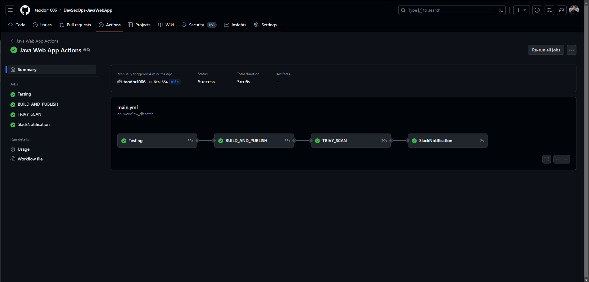

* Go to your SonarCloud Account and take a look at your project for potential bugs, code smells, etc.

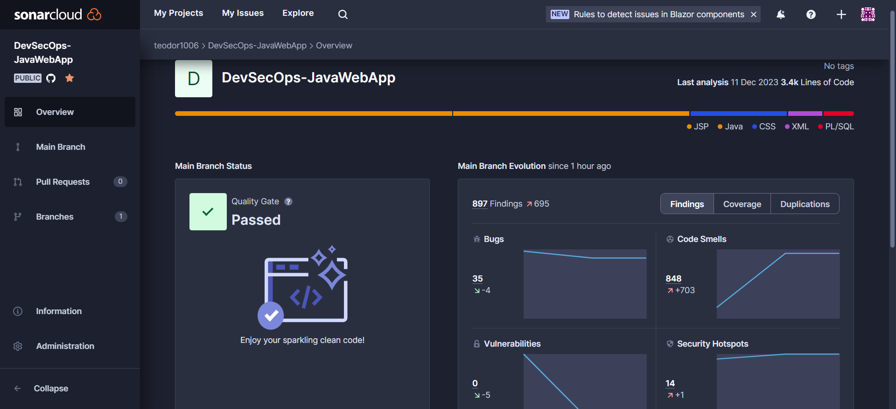

* Also you should get a notification from Slack:

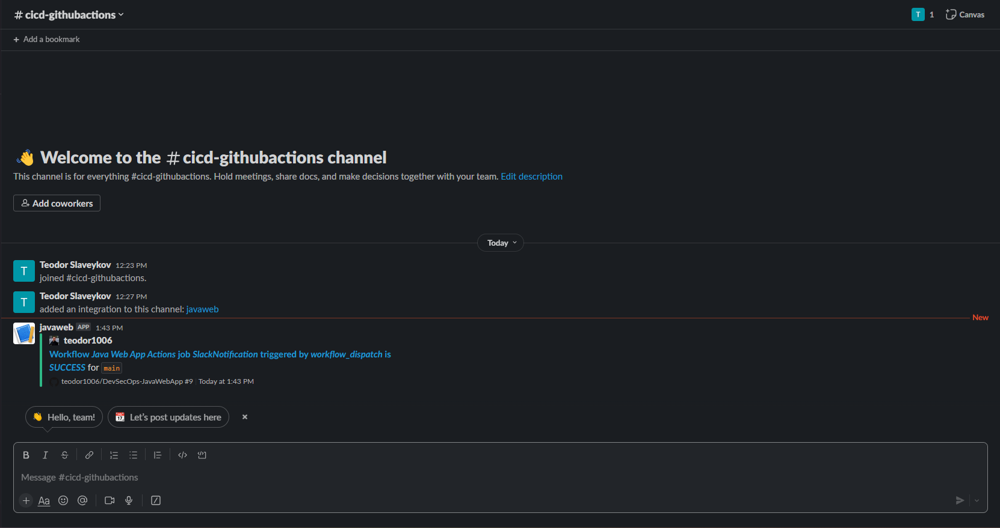

* After that go to your ECR Repo and you should see your uploaded DockerImage.


* Open the Security Tab in your github repo and see the trivy image scan.

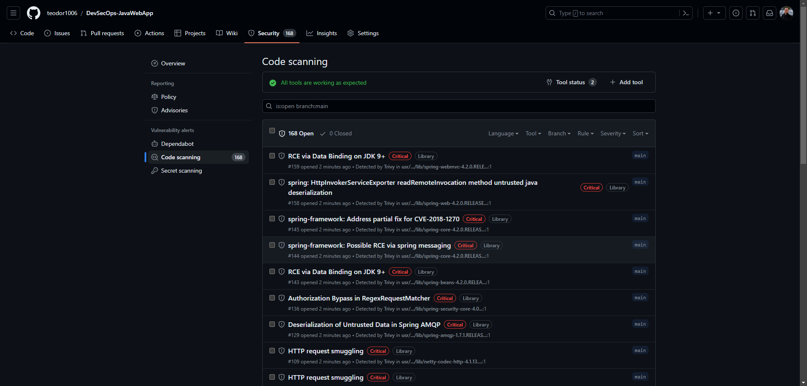


## **Part 7: Create Deployment and Service files for K8s helm charts**

* We need deployment and service files for MySQL, RabbitMQ, Memcached, Tomcat. In addition we need a Ingress file for Nginx.
* I am not going to explain in detail how I created them. You can see the templates in helm/vprofilecharts/templates.

## **Part 8: Run the terraform files for provisioning an EKS Cluster**

* Go to the terraform folder and run the following commands from your GitBash/Terminal:

```
terraform init
terraform fmt -check
terraform validate
terraform plan -out planfile
terraform apply -auto-approve -input=false -parallelism=1 planfile
```
* Wait about 15 minutes for creating the cluster and its nodes.

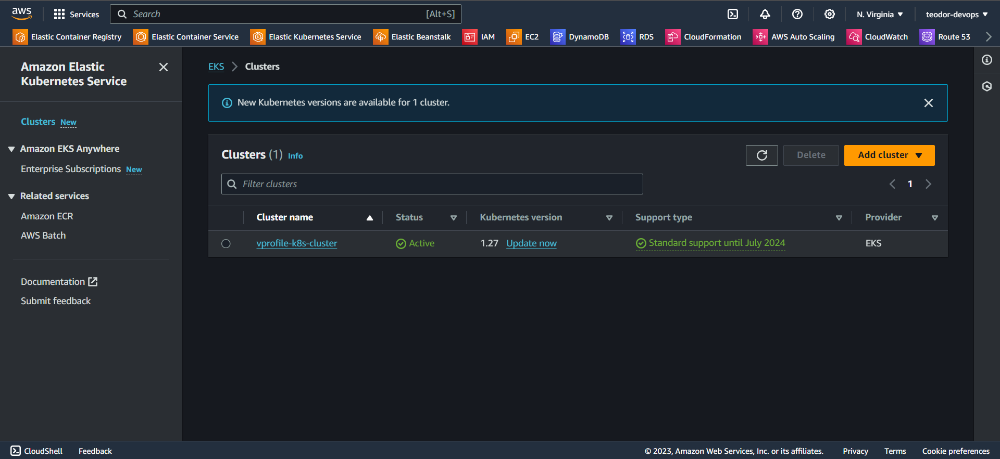
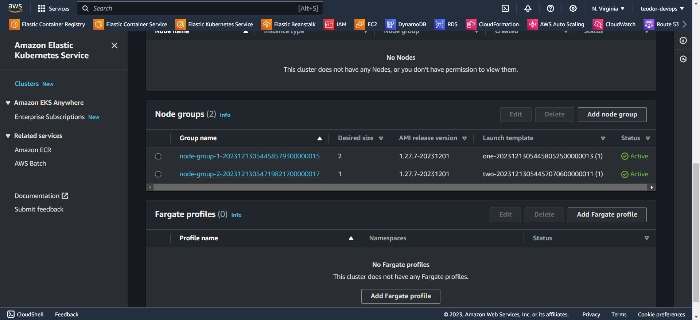

* Once everything is done, run the following command to install ingress:

```
aws eks update-kubeconfig --region us-east-1 --name vprofile-k8s-cluster
kubectl apply -f https://raw.githubusercontent.com/kubernetes/ingress-nginx/controller-v1.1.3/deploy/static/provider/aws/deploy.yaml
```

## **Part 9: Deploy to EKS and Access the Web Application**

### **Step 1: Final version of the workflow**

```
name: Java Web App Actions
on: workflow_dispatch
env: 
  AWS_REGION: us-east-1
  ECR_REPOSITORY: vpro-app-image
  EKS_CLUSTER: vprofile-k8s-cluster
jobs:
  Testing:
    runs-on: ubuntu-latest
    steps:
      - name: Code checkout
        uses: actions/checkout@v4

      - name: Maven test
        run: mvn test

      - name: Checkstyle
        run: mvn checkstyle:checkstyle

      - name: Setup Java 11
        uses: actions/setup-java@v3
        with:
          distribution: 'temurin'
          java-version: '11'

      - name: Setup SonarQube
        uses: warchant/setup-sonar-scanner@v7
   
      - name: SonarQube Scan
        run: sonar-scanner
           -Dsonar.host.url=${{ secrets.SONAR_URL }}
           -Dsonar.login=${{ secrets.SONAR_TOKEN }}
           -Dsonar.organization=${{ secrets.SONAR_ORGANIZATION }}
           -Dsonar.projectKey=${{ secrets.SONAR_PROJECT_KEY }}
           -Dsonar.sources=src/
           -Dsonar.junit.reportsPath=target/surefire-reports/ 
           -Dsonar.jacoco.reportsPath=target/jacoco.exec 
           -Dsonar.java.checkstyle.reportPaths=target/checkstyle-result.xml
           -Dsonar.java.binaries=target/test-classes/com/visualpathit/account/controllerTest/

      - name: SonarQube Quality Gate check
        id: sonarqube-quality-gate-check
        uses: sonarsource/sonarqube-quality-gate-action@master
        timeout-minutes: 5
        env:
          SONAR_TOKEN: ${{ secrets.SONAR_TOKEN }}
          SONAR_HOST_URL: ${{ secrets.SONAR_URL }} 


  BUILD_AND_PUBLISH:
    needs: Testing
    runs-on: ubuntu-latest
    steps:
      - name: Code checkout
        uses: actions/checkout@v4

      - name: Build & Upload Image to ECR
        uses: appleboy/docker-ecr-action@master
        with:
         access_key: ${{ secrets.AWS_ACCESS_KEY_ID }}
         secret_key: ${{ secrets.AWS_SECRET_ACCESS_KEY }}
         registry: ${{ secrets.REGISTRY }}
         repo: ${{ env.ECR_REPOSITORY }}
         region: ${{ env.AWS_REGION }}
         tags: latest,${{ github.run_number }}
         daemon_off: false
         dockerfile: ./Dockerfile
         context: ./
        
  TRIVY_SCAN:
    needs: BUILD_AND_PUBLISH
    runs-on: ubuntu-latest
    steps:
      - name: Code checkout
        uses: actions/checkout@v4

      - name: Run Trivy vulnerability scanner
        uses: aquasecurity/trivy-action@master
        with: 
          image-ref: '${{ secrets.REGISTRY }}/${{ env.ECR_REPOSITORY }}:${{ github.run_number }}'
          format: 'sarif'
          output: 'trivy-results.sarif' 
        env:
          AWS_ACCESS_KEY_ID: ${{ secrets.AWS_ACCESS_KEY_ID }}
          AWS_SECRET_ACCESS_KEY: ${{ secrets.AWS_SECRET_ACCESS_KEY }}
          AWS_DEFAULT_REGION: ${{ env.AWS_REGION }}

      - name: Upload Trivy scan results to GitHub Security tab
        uses: github/codeql-action/upload-sarif@v2
        with:
          sarif_file: 'trivy-results.sarif'

  DeployToEKS:
    needs: [BUILD_AND_PUBLISH, TRIVY_SCAN]
    runs-on: ubuntu-latest
    steps:
      - name: Code checkout
        uses: actions/checkout@v4

      - name: Configure AWS credentials
        uses: aws-actions/configure-aws-credentials@v1
        with:
          aws-access-key-id: ${{ secrets.AWS_ACCESS_KEY_ID }}
          aws-secret-access-key: ${{ secrets.AWS_SECRET_ACCESS_KEY }}
          aws-region: ${{ env.AWS_REGION }}

      - name: Get kube config file 
        run: aws eks update-kubeconfig --region ${{ env.AWS_REGION }} --name ${{ env.EKS_CLUSTER }}

      - name: Print config file 
        run: cat ~/.kube/config

      - name: Login to ECR 
        run: kubectl create secret docker-registry regcred --docker-server=${{ secrets.REGISTRY }} --docker-username=AWS  --docker-password=$(aws ecr get-login-password)

      - name: Deploy Helm
        uses: bitovi/github-actions-deploy-eks-helm@v1.2.8
        with:
          aws-access-key-id: ${{ secrets.AWS_ACCESS_KEY_ID }}
          aws-secret-access-key: ${{ secrets.AWS_SECRET_ACCESS_KEY }}
          aws-region: ${{ env.AWS_REGION }}
          cluster-name: ${{ env.EKS_CLUSTER }}
          chart-path: helm/vprofilecharts
          namespace: default
          values: appimage=${{ secrets.REGISTRY }}/${{ env.ECR_REPOSITORY }},apptag=${{ github.run_number }}
          name: vprofile-stack


  SlackNotification:
    needs: DeployToEKS
    runs-on: ubuntu-latest
    steps:
      - name: Send a Slack Notification
        if: always()
        uses: act10ns/slack@v2
        with:
          status: ${{ job.status }}
          steps: ${{ toJson(steps) }}
          channel: '#cicd-githubactions'
        env:
          SLACK_WEBHOOK_URL: ${{ secrets.SLACK_WEBHOOK_URL }}  
```
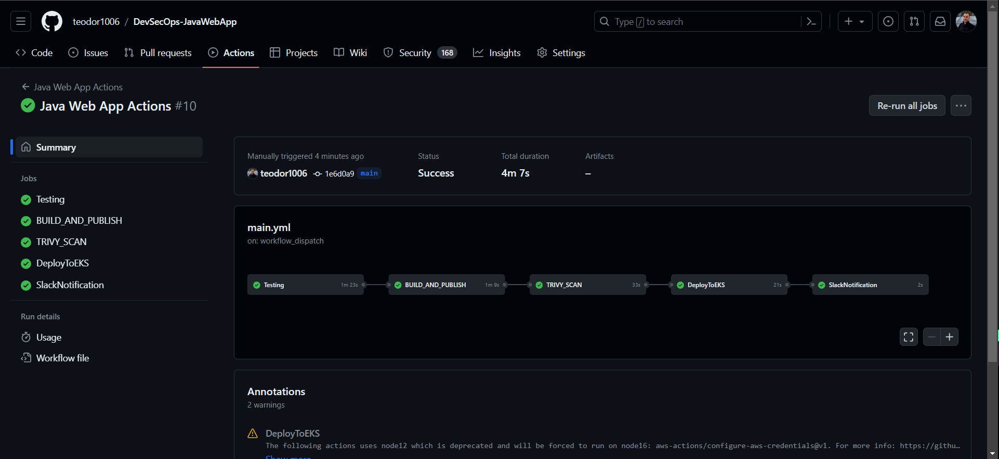

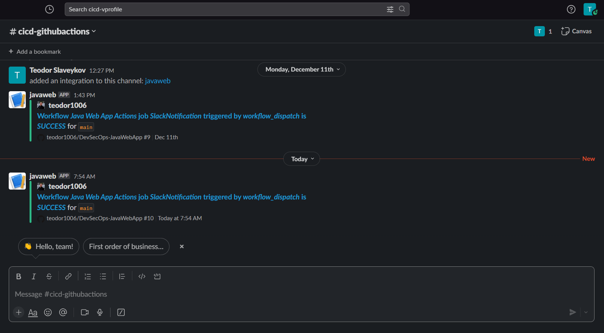

### **Step 2: Access the Web Application**

* Go to Amazon EC2 -> Load Balancers -> Copy the DNS Name

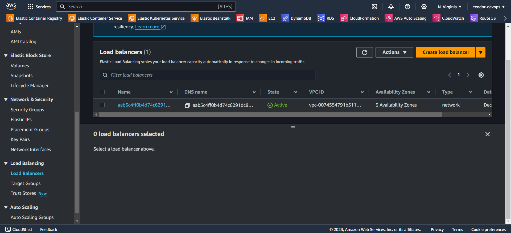

* Go to your GoDaddy domain -> Add a new record and paste the copied DNS Name


* After that open the browser and access the web app. In my case, it looks like that because of my domain name:

```
http://vproapp.hkh.college
```


## **Part 10: Clean up**

* Run these commands in your gitbash/terminal:

```
rm -rf ~/.kube/config
aws eks update-kubeconfig --region us-east-1 --name vprofile-k8s-cluster
kubectl apply -f https://raw.githubusercontent.com/kubernetes/ingress-nginx/controller-v1.1.3/deploy/static/provider/aws/deploy.yaml
terraform destroy -auto-approve
```
* After that is optional if you want to delete your S3 Bucket and ECR Repo.